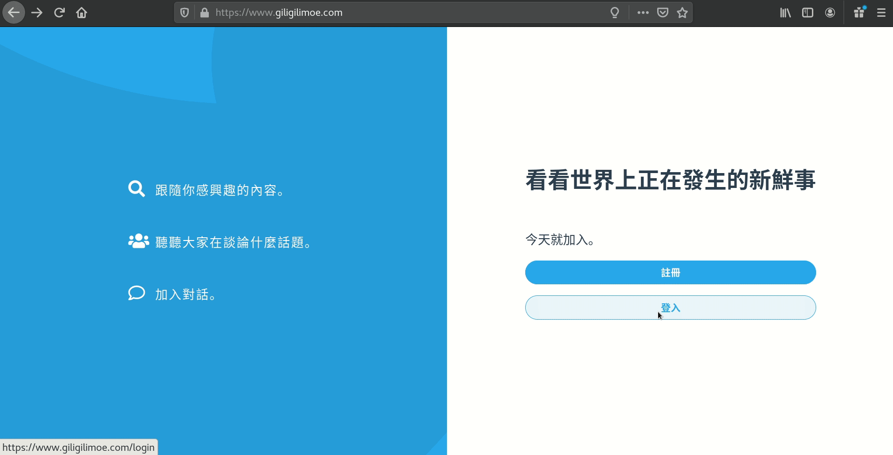
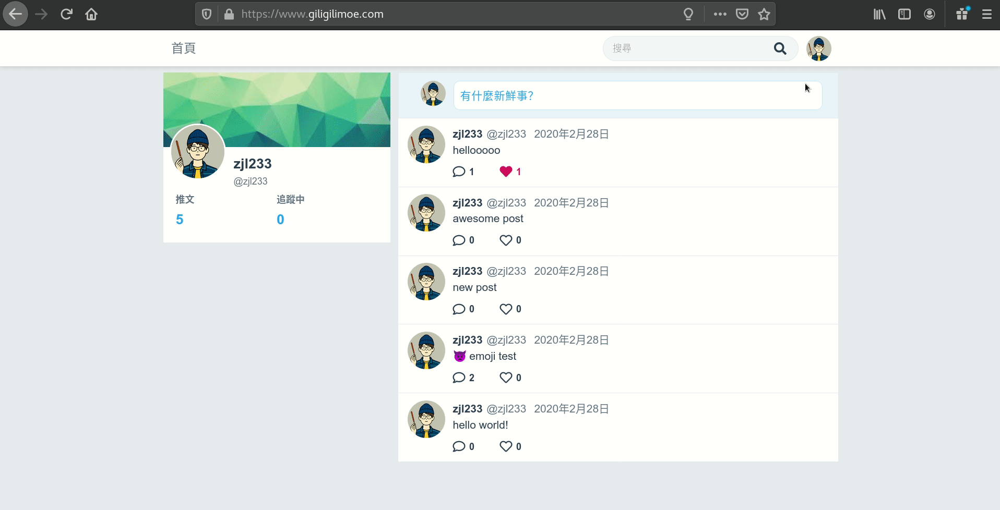

# Gotter 

Yet another twitter clone

demo www.giligilimmoe.com

## Screenshot


> login post comment



> search follow timeline


## Model relationship


## Project Structure

.
├── api            // api interface
│   ├── gotter_server.gen.go  
│   └── gotter_types.gen.go
├── docker-compose.yml
├── docker-compose.yml.example
├── Dockerfile
├── ent
│   ├── schema
│   │   ├── authtoken.go
│   │   ├── comment.go
│   │   ├── post.go
│   │   ├── timemixin.go
│   │   └── user.go
├── main.go        // project entry
├── README.md
├── serializer    
│   ├── comment.go
│   ├── post.go
│   └── user.go
├── spec
│   ├── gotter.http
│   ├── gotter.yaml
│   ├── rest-client.env.json
│   └── rest-client.private.env.json
└── srv             // api implement
     ├── auth.go
     ├── comment.go
     ├── follow.go
     ├── gotter.go
     ├── like.go
     ├── post.go
     ├── search.go
     └── user.go


## Stack

vue, golang, psql, nginx docker, openapi

## Install

```bash
docker-compose up -d
```

## Uninstall

```bash
docker-compose down 
```

## Acknowledge

JayZang's awesome frontend github.com/JayZang/twitter-clone

## Todos

- [ ] build trending system by redis

